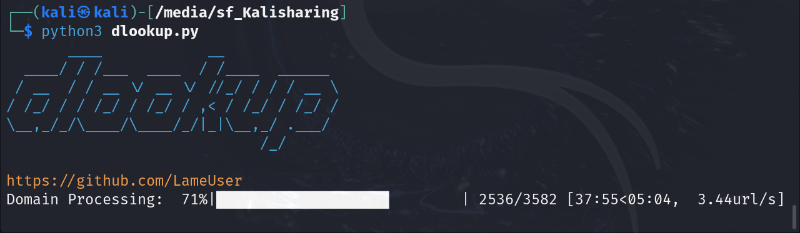

# dlookup Tool



`dlookup` is a Python-based tool designed to analyze domains and IPs, providing WHOIS, NSLOOKUP, geolocation data, and domain activity status. It outputs the results in an Excel file, making it a powerful utility for network analysts, security researchers, and developers.

## Features
- Extracts WHOIS and NSLOOKUP data for domains using advanced scanning techniques.
- Checks if a domain is active by verifying HTTP/HTTPS response status.
- Retrieves geolocation details such as country, city, ISP, ASN, and proxy status using `ip-api.com`.
- Outputs results in a comprehensive Excel file for easy analysis.
- Asks the User if screenshots of active domains are required or not.

## Installation

### Prerequisites
Ensure you have the following installed:

- Python 3.6 or higher
- Required Python libraries:
  - `aiohttp`
  - `pandas`
  - `tqdm`
  - `pyfiglet`
  - `termcolor`

To install the dependencies, run:

```bash
pip install aiohttp pandas tqdm pyfiglet termcolor
```
Installation of pyfiglet sometimes shows error in that case you may try 
```bash
import pyfiglet
```


### System Dependencies
Install `whois`, `nslookup` and `eyewitness` utilities if not already installed. On a Debian-based system, you can use:

```bash
sudo apt install whois dnsutils eyewitness
```

## Usage

1. **Clone the repository:**

```bash
git clone https://github.com/your-username/dlookup-tool.git
cd dlookup-tool
```

2. **Prepare your input file:**
   - Create an Excel file named `domains.xlsx` with a column named `URLS` containing the list of URLs/domains to analyze.

3. **Run the script:**
   - Execute the script and provide the folder path where the input Excel file is located.

```bash
python3 dlookup.py
```


## Output Details
The generated Excel file includes the following columns:

| Column            | Description                                      |
|-------------------|--------------------------------------------------|
| `URLS`            | The original URL or domain from the input file. |
| `Domain`          | Cleaned domain (e.g., `example.com`).           |
| `WHOIS Result`    | WHOIS lookup data for the domain.               |
| `NSLOOKUP Result` | NSLOOKUP data for the domain.                   |
| `Server IP`       | IP address retrieved from NSLOOKUP.             |
| `Domain Active`   | Status (`Yes`/`No`) based on HTTP/HTTPS checks. |
| `Successful Scheme` | Scheme (`http`/`https`) used for checks.       |
| `country`         | Country of the server IP.                       |
| `city`            | City of the server IP.                          |
| `isp`             | ISP associated with the server IP.              |
| `asn`             | ASN of the server IP.                           |
| `PROXY`           | Whether the IP is behind a proxy (`True/False`).|

## Example Workflow

### Input:
- Place an Excel file named `domains.xlsx` with the following structure:

| URLS              |
|-------------------|
| http://example.com|
| https://test.org  |
| www.sample.net    |

### Output:
   - The script generates:
     - An Excel file named `output.xlsx` containing detailed results for all domains.
     - A text file named `urls.txt` containing a list of clean domains.
     - A folder name `screenshots` containing all the screenshots of active domains.

## Contributing
We welcome contributions! Feel free to fork the repository, submit pull requests, or open issues for feature requests and bugs.

## License
This project is licensed under the MIT License. See the `LICENSE` file for details.
